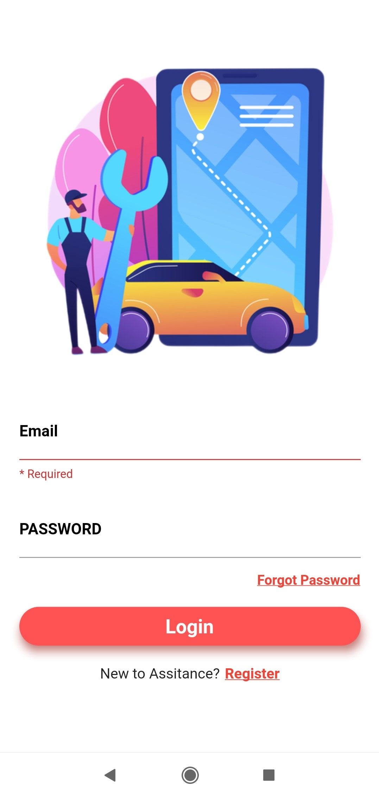
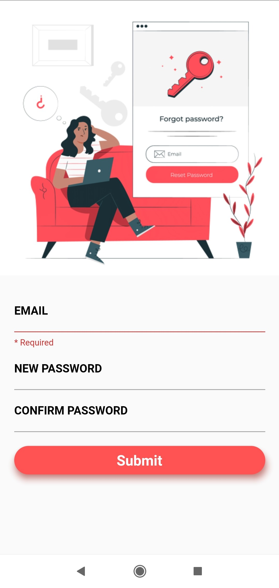
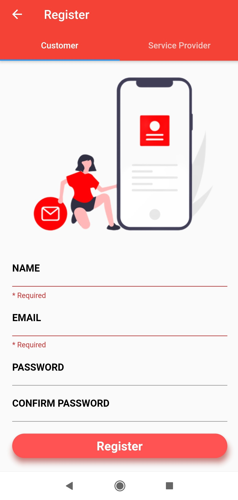
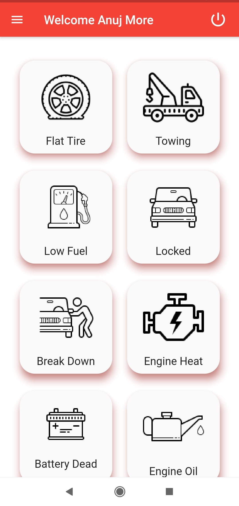
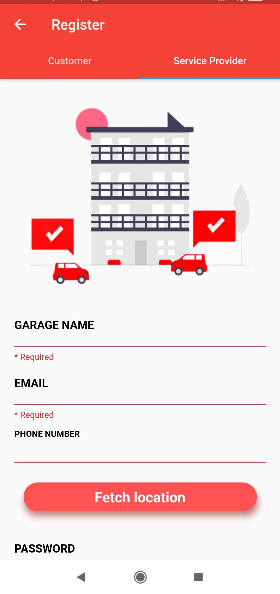
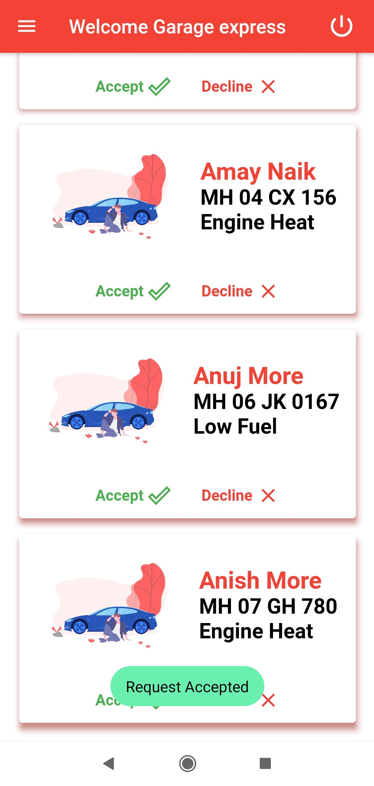

# Roadside assistance
# Roadside assistance is a cross-platform mobile application developed using a flutter framework. The application will provide a one-click view of the nearest service center whenever a user is stuck with some vehicle issue.

    

     

    

